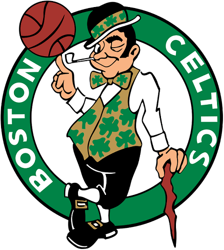

<h1>Proyecto de landing page con Bootstrap v5 - 1º DAW</h1>
<h2>Celtics - Website tribute </h2>
<h2>Indice</h2>
<ul>
  <li><a href="#introduccion">Introducción</a></li>
  <li><a href="#motivacion">Motivación</a></li>
  <li><a href="#estructura">Estructura</a></li>
  <li><a href="#estilo">Estilo</a></li>
</ul>

<h2 id="introduccion">Introducción</h2>

Trabajo realizado por: Sergio Ramos Alarcón 

Proyecto de web "from scratch" de 1ª evaluación de Lenguajes de Marcas

 16 de diciembre del 2023 

Licencia: NBA

<h2 id="motivacion">Motivación</h2>

El tema lo he elegido porque de pequeño era muy fan de este equipo de baloncesto y creo que hacer esta página web es para sentirme orgulloso de mí mismo. 

<h2 id="estructura">Estructura</h2>

La web está dividida en  X secciones:

<ul>
  <li>Home (Hero Section)</li>  
  <li>Introducción </li>
  <li>Trophies </li>
  <li>Video </li>
  <li>Gallery </li>
  <li>Footer </li>
</ul>

<h2>Hero Section</h2>

He utilizado una imagen de fondo tomada de una aportación de un fan, tiene una buena resolución y encaja perfectamente con la temática de mi página web. 
Encima de la imagen he colocado un botón que le lleva al usuario directamente al apartado de contacto de los Boston Celtics

 

<h2>Introducción</h2>
 

He dispuesto en un grid de 2 columnas, en una he puesto un accordion, y en la otra la imagen del escudo del equipo.

 

<h2>Trophies</h2>

He añadido los trofeos más relevantes para mí del equipo en un grid de 4 columnas y dentro sus respectivas cards, con su título y su pequeña descripción

 

<h2> Video </h2>

He añadido un vídeo de presentación del club de esta temporada. Está dentro de una card estilada correspondientemente 

 

<h2> Coaching Staff </h2>

He hecho un apartado parecido como el de trophies. Un grid de 4 columnas y cards para cada miembro del staff

 

<h2> Gallery </h2>

He añadido una galería mediante uso de clases y a estes le he añadido la propiedad flex.

 

<h2>Footer</h2>

 En el footer he añadido todos los recursos de la propiedad intelectual de Celtics, además de sus corrrespondientes propietarios

<h4>Localización</h4>

He añadido un enlace directo al estadio del equipo de baloncesto por si es que te da por querer ir a ver unos de sus emocionantes partidos.

<h2 id="estilo">Estilo de la página</h2>
<h3>Paleta de colores</h3>

 
    #008346 black white 

<h3>Tipografías</h3>

  Texto normal -> Helvetica Neue

  Títulos      -> Arial, sans-serif

<h3>Imágenes</h3>

 Imágenes incorporadas de la página web oficial de la NBA 

<h3>Videos</h3>

 Vídeo de la presentación de la temporada 

 https://www.youtube.com/embed/YcF_SS_KSag 

<h2 id="snippets">Code snippets</h2>

He utilizado los siguientes:

<ul>
  <li>Barra de navegación: tomada de bootstrap https://www.w3schools.com/howto/howto_js_topnav.asp](https://getbootstrap.com/docs/5.3/components/navbar/#how-it-works) </li>
  <li>Accordion: tomado de boostrap https://freefrontend.com/css-accordions/](https://getbootstrap.com/docs/5.3/components/accordion/#how-it-works) </li>
  <li>Modal: tomada de boostrap https://getbootstrap.com/docs/5.3/components/modal/#how-it-works </li>
</ul>
